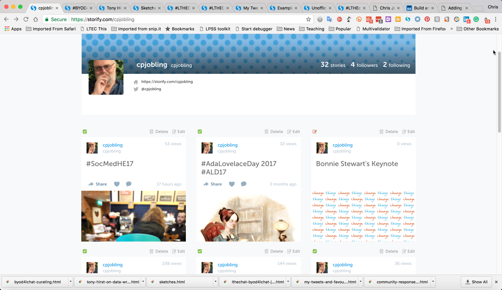

# Chris Jobling's Stories

This is an archive of the tweet chat stories that I originally created on [Storify](https://storify.com) ([storify.com/cpjobling](https://storify.com/cpjobling)] between July 2014 and December 2017. I created it as a response to the announcement that Storify service was being retired in May 2018.

.

## How I made this

Storify has provided an export feature which is able to save a published story as HTML5, XML or JSON. I used the HTML5 option which creates a single web page with the images, styles and JavaScript embedded then used my browser's *Save page as Webpage, complete* feature to create a complete local copy of the page and all its assets.

I created a new public project on GitHub ([https://github.com/cpjobling/stories](github.com/cpjobling/stories)) and used the [GitHub Pages](https://pages.github.com/) feature to create a static website repository of these saved stories that is accessible via [cpjobling.github.io/stories](https://cpjobling.github.io/stories).

By archiving a couple of handfuls of stories per session, the whole process took a few days.

Furthermore, the beauty of using Git is that the whole archive is just a set of files on my PC and I can create numerous copies. So there's no danger of losing the archive, even GitHub shuts down. Plus the archive, in the `gh-pages` branch of the [github.com/cpjobling/stories](https://github.com/cpjobling/stories) repository, is just a static website and can be hosted on any server. Git provides version control and support for distributed replication.

## What's next

I've demonstrated a solution to the archiving of a set of stories but the solution to the problem of curation of tweet chats is still open.

## The Archive

1. [#SocMedHE17](socmedhe17.html)
1. [#AdaLovelaceDay 2017 #ALD17](AdaLovelaceDay_2017_ALD17.html)
1. [Summer community-led pop-up #LTHEChat](pop-up-lthechat.html)
1. [Open - what do we value? #openedsig #altc](open-what-do-we-value.html)
1. [SALT Conference 2017 (#susalt17)](salt-conference-2017-susalt17)
1. [#BYOD4L and #CreativeHE Creations](byod4l-creations.html)
1. [My Day Curating for #BYOD4L](my-day-curating-for-byod4l.html)
1. [#BYOD4L Introductions and Connecting](byod4l-introductions.html)
1. [Students as Co-Creators: Integrating Research and Learning](student-co-creation-at-swanseauni-cocreateswan.html)
1. [#OneNoteQ TweetMeet](onenoteq-tweetmeet.html)
1. [#LTHEChat 66 - the growth of the network](lthechat-66-the-growth-of-the-network.html)
1. [Lecture capture](lecture-capture.html)
1. [#OneNoteQ Tweetmeet](onenoteq-tweetmeet-2.html)
1. [Swansea University SALT Conference 2016](swansea-university-salt-conference-2016.html)
1. [#HEWhitePaper](hewhitepaper.html)
1. [Micromouse Conflict Finals](micromouse-conflict-finals.html)
1. [#OER16 Day 1](oer16-day-1.html)
1. [#GuildChat Readdress the LMS](guildchat-readdress-the-lms.html)
1. [Wondering while wandering at #digifest16](wondering-while-wandering-at-digifest16.html) -- #WWW16 with @chrissinerantzi curated by me!
1. [#HEAchat/#LTHEchat February 2016](heachat-lthechat.html)
1. [#LTHEchat No 44 : Using music creatively to enhance non-music teaching](lthechat-45.html)
1. [HEA STEM Conference 2016 After Party](after-hea-stem-conference-16.html)
1. [HEA STEM Conference Day 1](hea-stem-conference-day-1.html)
1. [HEA STEM Conference 2016 - Day 2](hea-stem-conference-2016-day-1.html)
1. [#LTHEchat No 43 with Prof. Norman Jackson](lthechat-on)
1. [Unofficial story of final #BYOD4Lchat](unofficial-story-of-final-byod4lchat.html)
1. [Examples of useful curated resources (BYOD4L Jan 2016)](community-responses-to-q4.html)
1. [My Tweets and Favourites](my-tweets-and-favourites.html)
1. [#LTHEChat #byod4lchat - January 2014](lthechat-byod4lchat-january-2014.html)
1. [#RUL12AoC](sketches.html)
1. [Tony Hirst on Data Wrangling](tony-hirst-on-data-wrangling.html)
1. [#BYOD4Lchat: curating!](byod4lchat-curating.html)

Chris Jobling 
21st December 2017

----

 This work is licensed under a <a rel="license" href="http://creativecommons.org/licenses/by/4.0/">Creative Commons Attribution 4.0 International License</a>.
